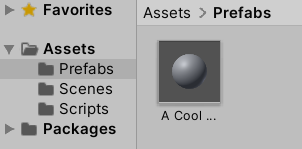
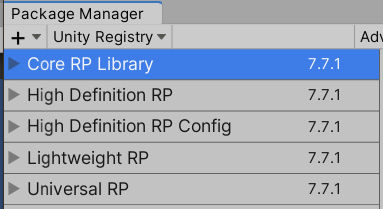

# Unity Crash Course

## Intro

Okay so first of all, i know [your gonna love this](https://youtu.be/tTelnNmRUH0).
Here's a link to the Unity docs:
https://docs.unity3d.com/ScriptReference/

Why the docs? Bc it explains functions and I am not gonna do that. What I plan to do is just telling you that stuff exist and what that stuff is used for. Sadly if you then wanna use that stuff you'll have to look at the docs and teach it yourself.

So how do you use this document? If you were not at one of the Crash Curses I did i would recommend just going through *all of it* once. Just once and click on all the links to the docs and look at the code stuff and make sure you know what the hell the thing you look at is used for. You can also take a look at the [Unity Crash Course Demo Project](https://github.com/Xientra/Unity-Crash-Course-Demonstration) that has most of this stuff implemented and use it as a reference.
Then later you hopefully remember things like <ins>Raycasting</ins> or <ins>Coroutines</ins> and can look up how it works then.

There's really not that much text here, it's gonna be fine.


---
<div style="page-break-after: always;"></div>

# Where the 🦆 do I even put my code?

You go right click on a folder in the Project viewer and click on new BehaviorScript.


This is where we put stuff.

There's two methods auto generated in there which we will probably wanna use. Unity is also so kind and explains them to us very cool :v
```csharp
// Start is called before the first frame update
void Start()
{
}
// Update is called once per frame
void Update()
{
}
```

There is also something called [FixedUpdate](https://docs.unity3d.com/ScriptReference/MonoBehaviour.FixedUpdate.html), which is just as `Update` and `Start` called by Unity.
```csharp
void FixedUpdate()
{
}
```
Essentially what you wanna know is that `FixedUpdate` is called every 0.02 seconds (stored internally in [Time.fixedDeltaTime](https://docs.unity3d.com/ScriptReference/Time-fixedDeltaTime.html)) and Update is called every **frame** and ***the time between frames is different each time and for each PC***.
How much time between two frames passed is stored in [Time.deltaTime](https://docs.unity3d.com/ScriptReference/Time-deltaTime.html).
FixedUpdate is more usefull if you want to do things with Physics because Unity physics update in the same rate as FixedUpdate.


---
<div style="page-break-after: always;"></div>

# Ok i made a script but how do I tell a thing to be affected by the script?

## Components


Essentially everything in Unity is a Component. **Your scripts are also Components!** and you can add them to a object by dragging them in the inspector.

Variables that are marked as `public` or have `[SerializeField]` above them are then shown in the inspector.

 

There's also [Hide in Inspector](https://docs.unity3d.com/ScriptReference/HideInInspector.html) to hide public variables.

#### Reference to Components

To now have a reference to the Collider you can drag and drop the Collider in there.

There is also a different way to get a component and that is with [GetComponent](https://docs.unity3d.com/ScriptReference/GameObject.GetComponent.html)
```csharp
Collider col = GetComponent<Collider>();
```
GetComponent is generic so you have to tell it what kind of component you want in the <> brackets.

Best way to do this is similar to Camera.main: get it once at the start and then store it.
```csharp
Collider col;
void Start()
{
	col = GetComponent<Collider>();
}
void Update()
{
	// do sth with the collider idk
}
```


---
<div style="page-break-after: always;"></div>

# I want to make stuff move!

## Input
There are various ways to get input in **IMGE** we will look at event based input for example.
I'll quickly go over the [Input Class](https://docs.unity3d.com/ScriptReference/Input.html) as it is probably the easiest one.

##### Keyboard Input
[Get Key Down](https://docs.unity3d.com/ScriptReference/Input.GetKeyDown.html)
```csharp
if (Input.GetKeyDown(KeyCode.Space))
	Debug.Log("space key was pressed");
```

##### Mouse Input
Mouse Input is in screen space (in pixel coordinates). Most of the time you want to convert it to World Space with [ScreenToWorldSpace](https://docs.unity3d.com/ScriptReference/Camera.ScreenToWorldPoint.html)
```csharp
Camera cam;
void Start()
{
	cam = Camera.main;
}
void Update()
{
	Vector3 mousePosScreenSpace = Input.mousePosition;
	Vector3 mousePosWorldSpace = cam.ScreenToWorldPoint(mousePosScreenSpace);
}
```
Don't use `Camera.main` in Update because it has ***really*** bad performance.

There is also [Screen Point To Ray](https://docs.unity3d.com/ScriptReference/Camera.ScreenPointToRay.html) which is really cool if you know what Raycasting is.

## Movement
Cool now we have input but how to move stuff now?
There's two (and probably more) ways to move things:
Transform Based & Physics Based

##### Transform Based
Literally hard set the position of the transform every Update. Basically means teleportation but in very small steps.
There are also different ways to do this:

```csharp
float speed = 1;
// 1. Translate (can be both global and local, here global)
transform.Translate(new Vector3(0, 0, speed * Time.deltaTime), Space.World);
// 2. add (global)
transform.position += new Vector3(0, 0, speed * Time.deltaTime);
// 3. add (local)
transform.position += transform.forward * speed * Time.deltaTime;
// 4. override position
transform.position = mousePosWorldSpace;
```
[transform.Translate](https://docs.unity3d.com/ScriptReference/Transform.Translate.html)
[transform.forward](https://docs.unity3d.com/ScriptReference/Transform-forward.html)
Also don't forget to multiply by `Time.deltaTime` if your working in `Update` to make movement framerate independent. [Here's why](https://youtu.be/Gcoj3llfzSw)

##### Physics Based
For physics we need the Rigidbody component: ...


...and get it in code:
```csharp
Rigidbody rb;
void Start()
{
	rb = GetComponent<Rigidbody>();
}
```

Now we can use it in update do various things to move it. Some here:
```csharp
float jumpForce = 10;
// Add Force
rb.AddForce(0, jumpForce, 0);
// add velocity
rb.velocity += new Vector3(0, jumpForce, 0);
// override velocity
rb.velocity = new Vector3(0, jumpForce, 0);
```
[Move Position](https://docs.unity3d.com/ScriptReference/Rigidbody.MovePosition.html)
[Rigidbody.velocity](https://docs.unity3d.com/ScriptReference/Rigidbody-velocity.html)

#### Rotate Stuff
There's these stupid Quaternions but there are various Methdos that make your life easier like [Quaternion.Euler](https://docs.unity3d.com/ScriptReference/Quaternion.Euler.html).
You can also change the forward Vector of a transform to easily rotate it towards something:
```csharp
Transform otherObject;
Vector3 toOtherObject = otherObject.position - transform.position;
transform.forward = toOtherObject;
```
[Here](https://www.youtube.com/watch?v=4mXL751ko0w) is also a ***really really cool*** video explaining Quaternions.

---
<div style="page-break-after: always;"></div>

# I wanna see things go clank and know where other stuff is in code

## Collision
***For the collision between two collider one of the objects needs a Rigidbody!***
Collider can be a trigger, which does not actually collide it just sends the collision (the OnTrigger) signal.


These are Methods automatically called by Unity:
```csharp
private void OnCollisionEnter(Collision collision)
{
}

private void OnTriggerEnter(Collider other)
{
}
```
[OnCollisionEnter](https://docs.unity3d.com/ScriptReference/Collider.OnCollisionEnter.html), [OnTriggerEnter](https://docs.unity3d.com/ScriptReference/Collider.OnTriggerEnter.html)
Note that `OnCollisionEnter` has a `Collision` object and `OnTriggerEnter` a `Collider` object.
A `Collision` Object also has a collider to it under `collision.collider`.

## Raycasting
**Raycasting** is another really cool way to interact with the collision system. It essentially lets you call a methods that checks a specified area for any collisions with objects.
A lot of the time that 'area' is just a line but it can also be a box for example.

***Remember that  Physics2D.Raycast only interacts with 2D Collider.***

Without much information: [Physics.Raycast](https://docs.unity3d.com/ScriptReference/Physics.Raycast.html)
```csharp
if (Physics.Raycast(transform.position, transform.forward))
	Debug.DrawRay(transform.position, transform.forward);
```

With information about the hit object: [also Physics.Raycast](https://docs.unity3d.com/ScriptReference/Physics.Raycast.html)
```csharp
RaycastHit hitInfo;
if (Physics.Raycast(transform.position, transform.forward, out hitInfo, Mathf.Infinity))
	Debug.DrawRay(transform.position, transform.forward * hitInfo.distance, Color.yellow);
```

With information about ALL object in that line: [RaycastAll](https://docs.unity3d.com/ScriptReference/Physics.RaycastAll.html)
```csharp
RaycastHit[] hits = Physics.RaycastAll(transform.position, transform.forward, 100.0f);
foreach (RaycastHit hit in hits)
	Debug.Log("hit " + hit.collider.name);
```

We are not limited to a simple line as well: [BoxCast](https://docs.unity3d.com/ScriptReference/Physics.BoxCast.html), [BoxCastAll](https://docs.unity3d.com/ScriptReference/Physics.BoxCastAll.html)
```csharp
RaycastHit[] hits = Physics.BoxCastAll(transform.position, new Vector3(0.5f, 0.5f, 0.5f), transform.up);
foreach (RaycastHit hit in hits)
	Debug.Log("hit " + hit.collider.name);
```

<div style="page-break-after: always;"></div>

## Tags (and Layers)

Cool you hit a thing but how do we know what that is?
With ***Tags***~.


At the very top every GameObject has both a Tag and a Layer. As you can see Unity has some default Tags.
```csharp
private void OnCollisionEnter(Collision collision)
{
	if (collision.collider.CompareTag("Player"))
		Debug.Log("Player has been hit");
}
```
This is an example from maybe a projectile that detects if the player has been hit by it.

### Layers
Layers are similar to Tags in a way, however Layers are more used to ignore collision completely between two groups of objects..


You can find this cool matrix to turn off collision in the Project Settings.

---
<div style="page-break-after: always;"></div>

# Cool I can do a lot with what I have in my Scene now but I wanna add *MORE*!
### Instantiate and Destroy

[Instantiate:](https://docs.unity3d.com/ScriptReference/Object.Instantiate.html)
```csharp
GameObject aCoolObjectPrefab;
Vector3 spawnPoint = new Vector3(1, 5, 34);
Instantiate(aCoolObjectPrefab, spawnPoint, Quaternion.identity);
```
Quaternion.identity just means no rotation.
[Destroy:](https://docs.unity3d.com/ScriptReference/Object.Destroy.html)
```csharp
GameObject objectToDestroy;
Destroy(objectToDestroy);
```
Destroy with delay (of 3 seconds):
```csharp
GameObject objectToDestroy;
Destroy(objectToDestroy, 3f);
```

### Prefabs
Prefabs are a way to store GameObjects that you created outside of scenes. Very useful for then creating copies of them when you play the game (Imagine a prefab for a projectile that you then create over and over while playing).
Just drag a object from the scene into a folder to create a Prefab.



when clicking on the prefab on the folder  and scrolling to the top you can then see *Open Prefab*, where you can edit it. You can also edit it directly here.
 
 In a script make a global variable public to see it in the Inspector:
```csharp
public class TestingScript : MonoBehaviour
{
	public GameObject aCoolObjectPrefab;
	...
}
```
or like this, which is a bit more clean:
```csharp
public class TestingScript : MonoBehaviour
{
	[SerializeField]
	private GameObject aCoolObjectPrefab;
	...
}
```

Now you have to drag and drop the prefab into the "None(GameObject)" slot:


The reference in the inspector does not *have* to be a Prefab btw. it can be any object from your scene.


Now you can instantiate `aCoolObjectPrefab` as often as you want with [[Unity Crash Course#Instantiate and Destroy|Instantiate]].

---
<div style="page-break-after: always;"></div>

# Ok one last thing, how do I wait in my code?

## Coroutines
These methods offer a simple way of waiting for some time and then executing some code.

```csharp
void Start()
{
	StartCoroutine(MyCoroutine());
}
public IEnumerator MyCoroutine()
{
	yield return new WaitForSeconds(3f);
	// code that is executed after 3 seconds
}
```
The most important thing to note here is that you have to start the Coroutine with `StartCoroutine` otherwise the waiting code will not work.

There are loads of tutorials out there to explain this further. I can recommend [This One](https://www.youtube.com/watch?v=Eq6rCCO2EU0) if you care.
Just know that if you wanna do something with *time*, <ins>Coroutines</ins> might be able to do that.

You can also stop your Coroutines if you don't want to wait for them to finish. This is done with [StopCoroutine](https://docs.unity3d.com/ScriptReference/MonoBehaviour.StopCoroutine.html).

---
<div style="page-break-after: always;"></div>

# *"Heyo, here are some more tips" -Paul*

## UI / Canvas
If you wanna make UI set your canvas to ***Scale With Screen Size***. ***Constant Pixel Size*** is default but sucks.


## Resolution

In the Game View you probably wanna set the Aspect from Free Aspect to 16:9.


Also turn off Low Resolution Aspect Ratio if it's on.

## Use Text Mesh Pro
You might have noticed how the normal Text is kinda blurry, which gets worse when scaling the UI.
I just recommend using Text Mesh Pro it an do anything and more, and is not really much harder to use (or hard to use at all).
```csharp
using TMPro;
public class TestingScript : MonoBehaviour
{
	public TMP_Text label;
}
```
In code you use it like this.

## Cooldown
If you want to add a delay to an action the user can take there are many ways. Coroutines for example.
But using 2 float variables and 1 if statement is a really simple way that also works very well:
```csharp
public float shootDelay = 0.5f;
private float timestamp = 0;


private void Update()
{
	if (Input.GetMouseButtonDown(0) && Time.time > timestamp)
	{
		Shoot();
		timestamp = Time.time + shootDelay;
	}
}
```
This sets the `timestamp` variable to a point in the future whenever the player shoots. And it can only happen again if the current time is after the point in the future that is saved in `timestamp`.

## Exit the Game
There is this nice bit of code that I wanted to share:

```csharp
#if UNITY_EDITOR
UnityEditor.EditorApplication.isPlaying = false;
#else
Application.Quit();
#endif
```
This will exit Playmode if you are working in Unity and exit the Game if you are playing it in a finished build. 

## Header and Space
To have a nicer Inspector you can use commands similar to `[SerializeField]` these are [`Header`](https://docs.unity3d.com/ScriptReference/HeaderAttribute.html) and [`Space`](https://docs.unity3d.com/ScriptReference/SpaceAttribute.html).
These can group the variables you see in the inspector.

```csharp
[Header("References:")]

public GameObject projectilePrefab;

[Space(5)]

public TMP_Text hitsLabel;
```

## Nice Graphics
There are different Render Pipelines in the Package Manager for Unity. If good graphics is something you want to focus on consider giving these a look.



Some of these will also Support Shader Graph, which I also recommend you look at.

## 100 Tips from Brackeys 
Here are loads of Tips from Brackeys give them a watch:
[100 Unity Tips](https://www.youtube.com/watch?v=thA3zv0IoUM)